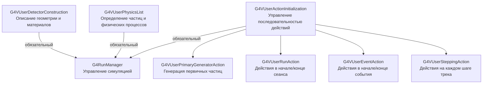

# Практическое занятие 1

## Что мы будем делать на практиках?

- Мы создадим готовое приложение Geant4 с нуля
- Смоделируем взаимодействие пучка частиц с простой кубической мишенью
- Подключим визуализацию
- Проведём сравнение с экспериментальными данными

## Что нужно знать перед практиками?

- ООП и C++
- Основы использования git
- UNIX-системы (опционально)

## План занятий (предварительный)

- **4/04**. 
    * Компиляция Geant4 приложений
    * Структура Geant4 приложений
    * Подключение RunManager и его обязательные элементы
- **11/04**.
    * Описание геометрии
    * Генерация начальных частиц
    * Пользовательские действия
- **18/04**.
    * Запуск. UI и batch моды
    * Визуализация
- **25/04**.
    * Вычисление энергопотерь $e^{-}$ в кремнии
    * Сравнение с экспериментом

## Установка

Информация по установке в [README файле](https://github.com/nchalyi/geant4_course_TSU_2026?tab=readme-ov-file#) этого репозитория.

.
.
.

## Часть 1. Компиляция Geant4 приложений

### 1.1. Стандартный компилятор

0) Запустим DOCKER по инструкции

1) Начнём с простейшей программы на C++. Создадим файл `hello.cc` и напишем следующий код:
```cpp
#include <iostream>

int main() {
    std::cout << "Hello, Geant4! " << std::endl;
    return 0;
}
```
2) Скомпилируем нашу программу
```bash
g++ -o hello hello.cc
```
3) Запустим
```bash
./hello
````
4) Мы использовали компилятор gcc для компиляции простейшей программы
5) Теперь добавим в нашу программу что-то из Geant4
```cpp
#include <iostream>
#include "G4Types.hh" // класс с типами данных из Geant4

int main() {
    G4int foo = 5;
    std::cout << "Hello, Geant4! foo = " << foo << std::endl;
    return 0;
}
```
6) Компилируем по-старому и получаем ошибку `No such file or directory`

7) Нужно добавить через флаг `–I` (include) место, откуда программе брать `.hh` файл и тогда все заработает!
```bash
g++ -I $G4INSTALL/include/Geant4/ -o hello hello.cc
```

8) Однако, нам могут понадобится не только `.hh` файлы, но и, например, библиотеки. Каждую такую библиотеку придется вручную добавлять в команду. Также для корретной работы нужно уточнить C++ стандарт (для Geant4 используется 17).
Изменим немного нашу программу:
```cpp
#include <iostream>
#include "G4Types.hh"
#include "globals.hh"

int main(){
	G4int foo = 5;
    G4cout << "Hello, Geant4! foo = " << foo << G4endl;
    return 0;
}

```
9) Тогда команда компиляции будет выглядеть так:
```bash
g++ -std=c++17 -I $G4INSTALL/include/Geant4/ -o hello hello.cc -L$G4INSTALL/lib64 -lG4global -lG4ptl
```

10) Но библиотек в Geant4 больше 1000! Поэтому используют сборщики проектов. В случае Geant4 это CMake.

### 1.1. Сборка через CMake

1) Сборка через CMake требует создания конфигурационного файла `CMakeLists.txt`. Из-за сложности синтаксиса, рекомендуется брать готовый, например:
```bash
# Настройка проекта
set(name hello)
cmake_minimum_required(VERSION 3.16...3.21)
project(${name})

# Поиск Geant4 библиотек. Активация доступных UI и визуализационный драйверов
# Если в задаче нет визуализации, её можно не подгружать, оставив в коде ниже только find_package(Geant4 REQUIRED)
option(WITH_GEANT4_UIVIS "Build example with Geant4 UI and Vis drivers" ON)
if(WITH_GEANT4_UIVIS)
  find_package(Geant4 REQUIRED ui_all vis_all)
else()
  find_package(Geant4 REQUIRED)
endif()

# Настройка путей к заголовочным файлам Geant4 и параметров компиляции
include(${Geant4_USE_FILE})

# Поиск sources и header файлов для проекта
include_directories(${PROJECT_SOURCE_DIR}/include 
                    ${Geant4_INCLUDE_DIR})
file(GLOB sources ${PROJECT_SOURCE_DIR}/src/*.cc)
file(GLOB headers ${PROJECT_SOURCE_DIR}/include/*.hh)

# Добавляем исполняемый файл и связываем его с библиотеками Geant4
add_executable(${name} ${name}.cc ${sources} ${headers})
target_link_libraries(${name} ${Geant4_LIBRARIES} )

# Устанавливаем в директорию bin 
install(TARGETS ${name} DESTINATION bin)
```

2) Добавим в папку с нашим `hello.cc` такой файл `CMakeLists.txt`.
3) Создадим подпапку `build` и перейдем в неё
```bash
cd build
```
4) Соберём проект
```bash
cmake ../ # Аргумент указывает на месторасположение CMakeLists.txt
make -j # После j можно указать чисто потоков для параллельной сборки, например make -j5
```
5) Запустим пример (исполняемый файл лежит в build директории)
```bash
./hello
```
6) Все должно заработать.

### 1.2. Сборка и запуск готовых примеров Geant4
Проведём компиляцию стандартного примера `B1` и убедимся в его работоспособности

1) Перейдем в директорию `DAY-1/Examples/B1` репозитория
2) Создадим там папку `build`
3) Соберём проект и запустим
```bash
cmake ../
make -j
./exampleB1
```
4) Если не появляется ошибок, а в конце видим сообщения об удалении `RunManager` - все прошло успешно!

### 1.3. Самостоятельная работа

1) Попробуйте собрать пример `Hadr01` из `Examples`
2) Запустите их в двух режимах
```bash
./Hadr01            # Запуск с визуализацеий
./Hadr01 hadr01.in  # Запуск в batch-режиме, с выводом в командную строку
```
3) Попробуйте изменить входные параметры в `hadr01.in` и посмотреть что произойдет
4) Тоже самое сделайте и для `TestEm9` 

## 2. Создание приложения с нуля

### 2.1. Структура нашего проекта

1) Создадим папку для нашего проекта (например, `myproject`)
2) Внутри создадим файл `CMakeList.txt` с содержимым показаным выше
3) Создадим файл `myproject.cc` - основной управляющий нашим проектом код
4) Создадим папки `srс`, `include` и `build`
5) Так должна выглядеть получившаяся структура:
```text
myproject/──────────────────────────────────────────────────────────────────────
├── CMakeLists.txt          # 1. Файл для сборки проекта (CMake)
├── myproject.cc            # 2. Главный файл с функцией main()
├── run.mac, vis.mac        # 3. Макросы  
│
├── include/                # 4. Заголовочные файлы .hh (объявление)
│   ├── DetectorConstruction.hh     # Геометрия
│   ├── ActionInitialization.hh     # Инициализация действий
│   ├── PrimaryGeneratorAction.hh   # Генерация начальных частиц
│   ├── RunAction.hh                # Действия в начале и конце всего сеанса
│   ├── EventAction.hh              # Действия в начале и конце одного события
│   └── SteppingAction.hh           # Действия на каждом шаге трека
│
├── src/                    # 5. Исходные файлы .cc (реализация)
│   ├── DetectorConstruction.cc
│   ├── ActionInitialization.cc
│   ├── PrimaryGeneratorAction.cc
│   ├── RunAction.cc
│   ├── EventAction.cc
│   └── SteppingAction.cc
├── build/                  # 6. Файлы сборки
└───────────────────────────────────────────────────────────────────────────────
```
*Комментарий*: Проекты на Geant4 можно собирать любым удобным вам образом, в этом курсе мы следуем стандартной архитектуре, используемой в исходном коде и примерах Geant4.



### 2.1. Основной файл

1) В файле `myproject.cc` напишем следующий код:
```cpp
#include "G4RunManagerFactory.hh"
#include "globals.hh"

#include "MyDetectorConstruction.hh"
#include "MyActionInitialization.hh"

#include "G4PhysListFactory.hh"

int main(){
	
	auto* runManager = G4RunManagerFactory::CreateRunManager(); // Сердце нашего приложения, управление всеми процессами
	
	MyDetectorConstruction* detector = new MyDetectorConstruction;
	runManager->SetUserInitialization( detector ); // Подключение геометрии нашего детектора
	
	G4PhysListFactory plFactory;
	G4VModularPhysicsList *pl = plFactory.GetReferencePhysList( "FTFP_BERT" );
	runManager->SetUserInitialization( pl ); // Подключение физики
	
	runManager->SetUserInitialization( new MyActionInitialization ( detector ) ); // Подключение модуля управления действиями, которому в аргумент указывается детектор
	
	runManager->Initialize(); // Запуск приложения
	
	runManager->BeamOn(10); // Запуск пучка частиц
	
	G4cout << " === END OF SIMULATION === " << G4endl;
	delete runManager; // Очистка указателя на runManager (на всякий случай)
	return 0;
}
```

2) Уберём в комментарии все кроме физики и проведём процедуру сборки.


